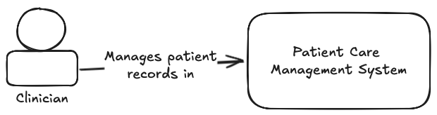
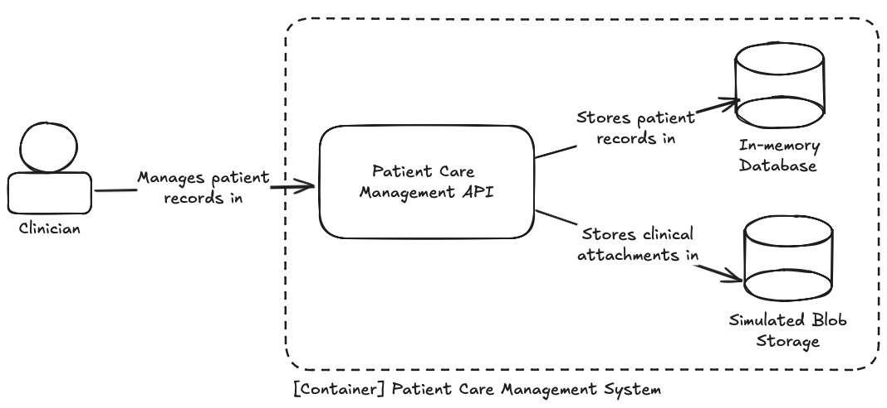

# Patient Care Management System

## Overview

The Patient Care Management System is a simple application designed to manage patient records. It provides the basic
functionality needed to create, retrieve, update, and delete patient records and clinical attachments.

## Setup & Running the Project

### Prerequisites

Before running the project, ensure that you have the .NET 9 SDK installed. Additionally, a REST client such as Postman
is useful for interacting with the API. For convenience, a web-based client is available
at http://localhost:5016/#tag/mcgpcmsapi.

### Running the API Locally

To start the application, navigate to the project directory and run the following command:

```sh
dotnet run --project src/Mcg.Pcms.Api
```

Once the application is running, the API will be available at `http://localhost:5016`.

### Running with Docker

Alternatively, it's possible to use the Dockerfile included in the `deploy/` directory to run the application. From the
root directory, build the image by running:

```sh
docker build -t pcms -f deploy/Dockerfile .
```

Next, launch the container by running:

```sh
docker run -p 5016:5016 pcms
```

The API will be available at `http://localhost:5016`.

The container runs the application using a non-root user for improved security. This reduces the attack surface and
follows best practices for containerized applications.

### Authentication and Accessing Endpoints

Many of the endpoints this API exposes require authentication. Before making requests to these endpoints, you must
register an account and obtain a bearer token.

First, send a POST request to the registration endpoint:

```http request
POST http://localhost:5016/register
Content-Type: application/json

{
  "email": "azurediamond@example.com",
  "password": "Hunter2!"
}
```

Now that you have created a new user, request a bearer token by sending a POST request to the login endpoint:

```http request
POST http://localhost:5016/login
Content-Type: application/json

{
  "email": "azurediamond@example.com",
  "password": "Hunter2!"
}
```

The response will include a field named `accessToken`. You will need to include this in the authorization header for all
protected endpoints.

You can use the provided .http file to easily test API endpoints if your IDE or HTTP client supports it. Simply open the
.http file, run requests in order, and the authentication token will be automatically retrieved and applied to
subsequent requests.

### Running the Test Suite

The test suite covers both unit tests and API endpoint tests. To execute these and ensure the system is functioning
correctly, use the following command:

```sh
dotnet test
```

## Design

### High-Level Architecture

The system is structured into three main layers, each with a clear responsibility.

The **API Layer**, found in `Mcg.Pcms.Api`, is responsible for handling incoming HTTP requests and defining the Minimal
API routes. It provides the endpoints for managing patients and clinical attachments.

The **Core Layer**, located in `Mcg.Pcms.Core`, contains the main application logic and acts as an intermediary between
the API and the repository. This layer also defines the `IPatientRepository` interface, providing an abstraction over
the data storage. It also defines request objects such as `CreatePatientRequest` and `UpdatePatientRequest` to ensure a
clear separation of concerns.

The **Infrastructure Layer**, implemented in `Mcg.Pcms.Infrastructure`, provides the actual data storage implementation.
It uses Entity Framework Core with an in-memory database for storing patient records. Additionally, it simulates blob
storage using a `ConcurrentDictionary`, which lazily initializes storage upon the first attachment being added.

### C4 System Context Diagram



### C4 Container Diagram



### C4 Component Diagram


## Design Considerations & Trade-Offs

One of the primary design decisions in this project was the use of an in-memory database instead of a persistent storage
solution. This simplifies setup and allows for rapid iteration, but results in complete data loss between application
restarts, making it unsuitable for production use.

Another was the decision to use GUIDs instead of integers for patient IDs. GUIDs help mitigate insecure direct object
reference and scaling issues that may arise with sharded databases, but they introduce a slightly larger storage
footprint and indexing overhead.

To maintain a clear separation between the API layer and the domain model, request objects such as
`CreatePatientRequest` and `UpdatePatientRequest` are used instead of exposing entity models. This improves API contract
stability but requires additional mapping logic.

For simplicity, the system does not use separate DTOs for responses. Instead, `Patient` entities are returned directly.
This approach reduces unnecessary mapping, though it may require refactoring in the future if response formats need to
be modified.

Finally, Minimal API was chosen over traditional MVC controllers to reduce boilerplate.

## Future Enhancements

Although the current implementation is functional, there is significant room for improvement.

A durable storage solution, such as PostgreSQL, would provide better data retention and support larger-scale usage.
Similarly, integrating real blob storage would be more appropriate for persisting binary data.

Introducing "soft" deletes would allow patient records to be marked as inactive rather than permanently deleted. This
would help retain historical data for auditing purposes.

Another major improvement would be shifting from a CRUD-centric design to a workflow-driven approach, allowing the
system to capture the context and intent behind patient actions. In its current state, there is no way to capture _why_
a change occurred. Was a patient created because they were transferred in from another system? Were they a walk-in or
was it a remote consultation? The application is unable to answer any of these questions.

A greater focus on modeling business use cases would also allow us to more easily introduce an event-driven design. As
the system grows, an event-driven architecture would allow us to support powerful, asynchronous workflows.

Finally, integrating with Open Telemetry would provide better visibility into usage and performance.
